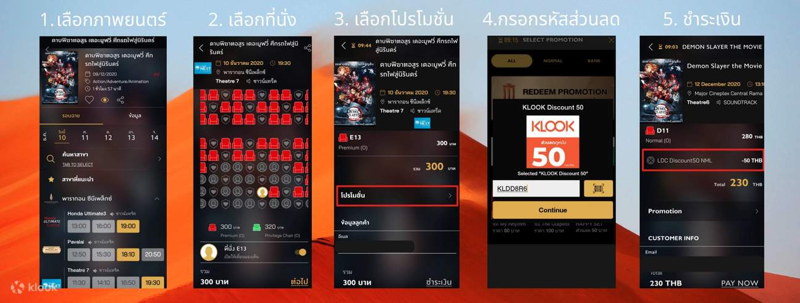
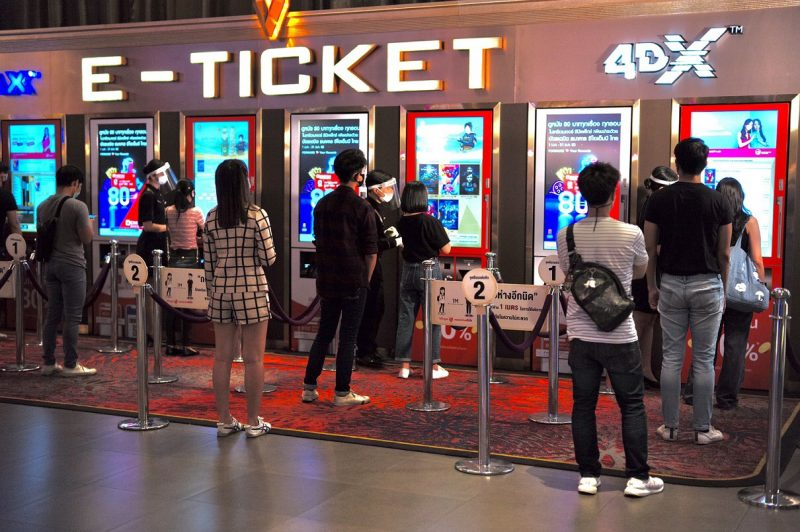

## Case 2: Race condition

**Existing component**: Core booking engine

**Channel**: Box office, Website, Mobile application

**Process**:
1. **Pick the seat**
2. Fill in promo code
3. Fill in user information
4. Buy add-on e.g. popcorn, pepsi
5. **Proceed with the checkout**

**Pain point**: user feel bad spending all time filling the information but cannot checkout because other people already book the seat.

**Task**: Please design the solution to overcome such problem.