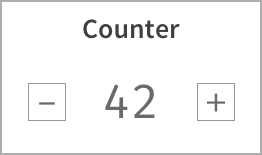

## Question 4 (React/React Native)
Given: UI image. \

Find: Make UI for the counter gadget with interaction as in the given image

> **Acceptance Criteria**:
> 1. Initial state should display 0
> 2. When click '+', increment the displayed number by 1
> 3. When click '-', decrement the displayed number by 1